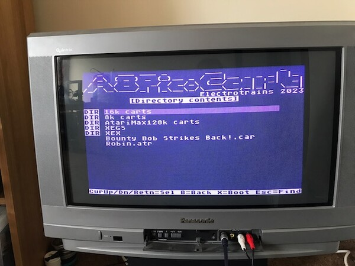
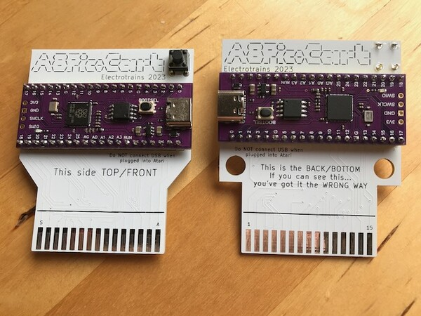
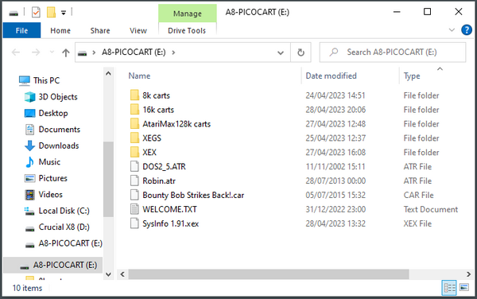
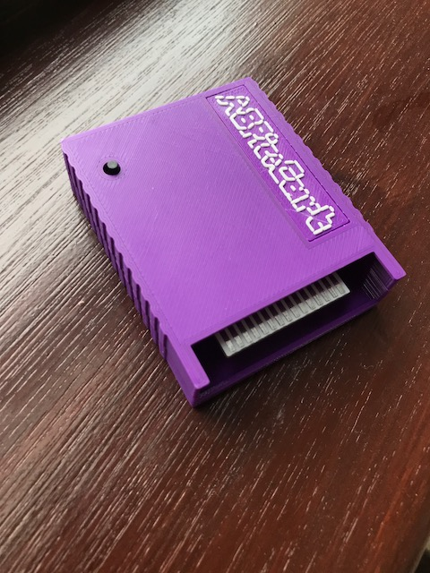
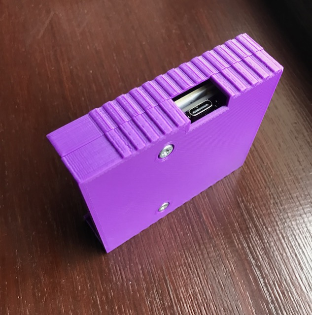

# A8PicoCart (UnoCart on a Raspberry Pi Pico clone)

The A8PicoCart is a multi-cart for the Atari 8-bit (XL/XE) which you can make at home with only basic soldering skills.
It is based on my earlier UnoCart design but uses a very inexpensive Raspberry Pi Pico clone (£2-3) for an easy build.

When plugged into a PC by USB it becomes a Mass Storage device allowing ROM/CAR/XEX & ATR files to be copied to the cartridge.
When plugged into an Atari these files are shown on the menu and the device will either emulate the selected cartridge type or
act as a XEX file launcher. It also has (very) limited support for ATR files allowing you to do some programming and save your
work to an ATR file.

This page contains everything you need to build the project - firmware to flash to your purple Pico clone, Kicad PCB design files to make a PCB and 3d print files for a nice case. The source code for everything is also here. There is also a manual detailing the full capabilities of the cartridge.

If you build an A8PicoCart consider donating to help fund this and my future projects:

## Quick Start

Get yourself a purple Raspberry Pi Pico clone (see [this thread](https://forums.raspberrypi.com/viewtopic.php?t=337976) for details) and order a PCB using the KiCad board files provided. You have a choice of two PCB desgins - the XE design is for use uncased, with the Pico on the top surface. The XL/XE version is desgined to be mounted in a case (though can be used uncased too) with the Pico on the bottom/back surface. Once you have the Pico clone and PCB, solder the pico as pictured below, depending on your PCB version. Program the firmware onto the device by pressing BOOTSEL on the board and connecting to USB on a PC and drag the firmware (UF2 file) onto the device. It should then remount as A8-PICOCART so you can copy Atari CAR & XEX files to it. Unmount, then plug into your Atari and play! Optionally solder a reset button to reset back to the menu.

**Warning**: always disconnect from PC/USB before plugging into your Atari or you will damage your Atari and/or PC.

## Inserting the cartridge

Depending on which PCB you choose the Pico clone may be mounted on the front or back of the PCB. When you insert
the cartridge in the Atari make sure the "S..A" side of the cartridge edge (NOT the "1..15" side) is facing upwards (XE) or towards you (XL).

## Purple Pico clones

The firmware is designed for the Purple Pico clones with USB C connector and 16Megs of flash and a single button (BOOTSEL).
I've received these devices with two different types of SPI flash chips - Winbond and (slower) Z-bit. The firmware has been tested with both types.

The project defines a custom board with a higher value for PICO_FLASH_SPI_CLKDIV so it supports the slower Z-bit flash.

Be aware that it's possible you might get one with another type of flash memory chip that has not been tested.

## Reset button

You can solder a push button to the cartridge to get back to the menu and avoid wear on your Atari power switch.
When you reset the cartridge the Atari will crash - push reset on the Atari to get back to the menu.

The button used is a 6x6mm thru-hole tactile momentary switch. If you are going to print a case, then 9mm height is suitable.
When you solder the button to the PCB - make sure the lower two holes in the PCB are bridged only when the button is pressed.

It works simply by pulling the RUN pin to ground to reset the pico clone.

## 3D print files

The STL files can be used to print a 3 piece (front, back and logo) cartridge shell. The 2-tone logo is achieved by
changing the filament at the correct z-position when printing a8pico_logo.stl.

## Credits
-------
* Design, hardware and firmware by Robin Edwards (electrotrains at atariage)
* XEX loader and OS modifications by Jonathan Halliday (flashjazzcat at atariage)
* Altirra LLE OS used with permision from Avery Lee (phaeron at atariage)

